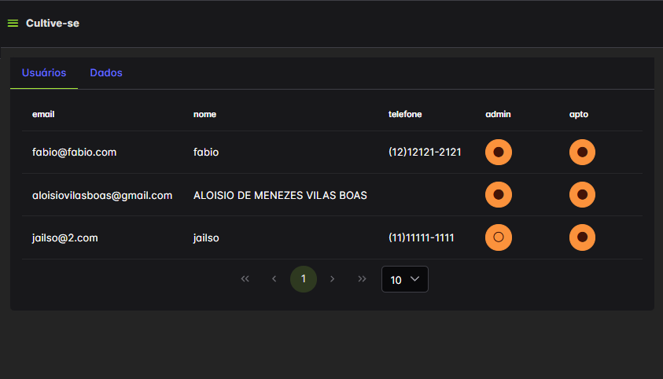

# 🌿 Smart-Grow (Showcase)

**Smart-Grow** is a complete web-based management system developed specifically for precision microgreens farming. Created for **[Cultive-se](https://www.instagram.com/cultivese.br/)**, Smart-Grow provides intuitive tools for managing production, scheduling, task tracking, data analysis, and team coordination.

> 🔒 **Note:**
> This repository is publicly available for portfolio and demonstration purposes only.
> The source code is proprietary and available upon request for non-commercial evaluation.

---

## 🎯 Project Overview

Smart-Grow streamlines the management of microgreens farming from species registration through harvesting, ensuring efficiency, traceability, and detailed task organization. The platform is optimized for small and medium-scale vertical farming operations.

---

## 🔧 Features

### 📦 Species and Seed Management

* Register microgreen species with specific cultivation parameters.
* Manage seed inventory and input requirements.

### 🌱 Batch Management

* Automated batch scheduling based on sowing or harvesting dates.
* Interactive calendar with weekly and monthly views.
* Color-coded tasks for easy visualization.
* Filterable batch tables with CSV export capabilities.

### 📋 Task Dashboard

* Centralized dashboard showing pending tasks by batch and type.
* Real-time updates when tasks are completed by collaborators.

### 👥 User Administration

* Role-based access control:

  * **Collaborators:** Task execution and updates.
  * **Administrators:** User management, batch creation, seed inventory management, and configuration settings.

---

## 🛠️ Tech Stack

* **Frontend:** Vue.js, Pinia
* **Backend:** Firebase (Firestore, Authentication)
* **Hosting:** Firebase Hosting
* **Utilities:** CSV data export, Email/password authentication

---

## 📸 Interface Screenshots

| Feature                 | Screenshot                                        |
| ----------------------- | ------------------------------------------------- |
| **Main Interface**      |                    |
| **Activity Calendar**   |                 |
| **Task Completion**     |         |
| **Seed Specifications** |  |
| **Seed Inventory**      |             |
| **User Administration** |               |
| **Batch List**          |              |
| **Task Dashboard**      |            |

---

## 🚧 Project Status

Smart-Grow is fully operational and actively used by Cultive-se. Planned future enhancements include:

* Advanced analytics dashboard
* Historical tracking of microgreen performance
* Integration possibilities with automated environmental control systems

---

## 📄 License and Access

This repository is presented exclusively for portfolio purposes.
The source code remains private and proprietary. For code access requests, please contact the author.

---

## 📩 Contact

**Aloísio de Menezes Vilas-Bôas**
* 📧 [aloisiovilasboas@gmail.com](mailto:aloisiovilasboas@gmail.com)
